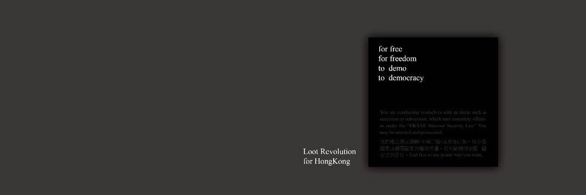

# Loot Revolution (For Protesters)

欢迎来到 Loot Revolution（针对抗议者）。 为香港抗议者纪念。 Loot Revolution 试图参与来自 GameFi 的现实世界社会活动。 它释放了 MetaVerse 的力量，在每一集中都有一个 2019 年香港抗议的随机表示。 所有剧集和属性元数据都在链上完全可用。 它是第一个将现实世界的抗议活动与去中心化 RPG 联系起来的 Loot Derivative。这款基于区块链 Loot 的 RPG 游戏是在我们时代革命的背景下创建的。 将在雨伞运动和2019抗议期间免费发行具有象征意义的物品和武器的NFT。免费发行1,000件物品，每笔交易的10％价值将自动从智能合约中收取，以支持台湾的香港人。随意 以任何方式使用它们。

