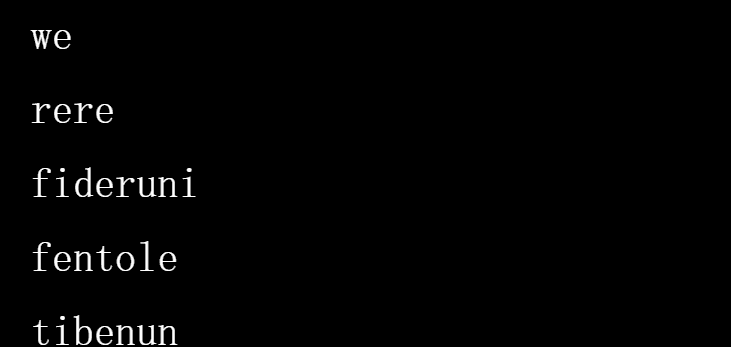

# Lootlang Official

Lootlang 是一种在链上生成和存储的完整语言。 故意省略词义以供他人解释。 随意以任何你想要的方式使用 Lootlang，即使是你的日常 schluba。 在 lootlang.com 和 twitter.com/lootlang 了解更多信息

薄荷（0.02 ETH ）

您将收到一包 8 个单词，由 链上算法在铸币时生成。甚至 Jobjuga 都不知道你会得到什么。

剩余 1,348 个中的0个

随机播放

每个包最多可以洗牌 5 次，以丢弃您不想要的单词。选择 1 个或多个您希望在每次随机播放时保留的单词。你喜欢长词（很少见）、听起来很酷的词、听起来很有趣的词，或者可能是一起玩得很好的词吗？那是你的决定。

大冻结

传说在区块，所有剩余的 shuffle 都被销毁，Lootlang 永远固化在区块链上。有人说有一个强大的巫师可以安抚更改区块号，但这可能只是一个老妇人的故事......

