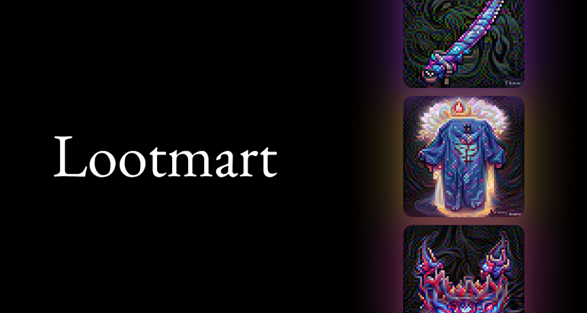

# Lootmart

Lootmart 将您的战利品袋拆分成单独的 Lootmart 物品，您可以交易并使用这些物品来升级您在 Loot 世界中的冒险家。过去 7 天没有售出任何 Lootmart。领取您的战利品解锁您的个人战利品、交易它们并升级您的冒险家。

Lootmart NFT - 常见问题（FAQ）
▶ 什么是 Lootmart？
Lootmart 是一个 NFT（不可替代令牌）集合。存储在区块链上的数字艺术品集合。
▶ 有多少 Lootmart 代币？
总共有 1,563 个 Lootmart NFT。目前，402 位所有者的钱包中至少有一个 Lootmart NTF。
▶ 最近售出了多少 Lootmart？
过去 30 天内售出 0 个 Lootmart NFT。

