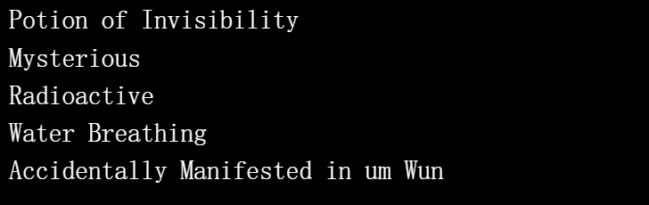

# Potions (for Adventurers)

药水是随机生成并存储在链上的。 图像和其他功能被故意省略以供其他人解释。 随意以任何你想要的方式使用药水。 受 Loot 启发并兼容（适用于冒险家）。

我们正在构建下一代 P2E 游戏
@仲裁
  使用所有链上数据。 不会使用元数据。

这是真正的无许可游戏。

如何为所有人铸造药水：

✅ 第一步：在 Etherscan 合约页面选择“Write Contract”
✅ 第2步：选择“2.mint”功能
✅ 第 3 步：为“mint”输入“0.02”，为“tokenId (uint256)”输入所需的药水“tokenID”编号

