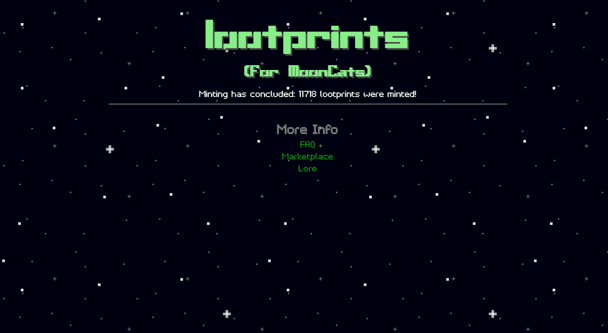

# lootprints (for MoonCats)

lootprints (for MoonCats) NFT 在过去 7 天内售出 3 次。战利品（MoonCats）的总销售额为 128.44 美元。一个战利品（对于 MoonCats）NFT 的平均价格为 42.8 美元。有 2,274 个战利品（用于 MoonCats）所有者，总共拥有 11,718 个代币。

什么是战利品（对于 MoonCats）？

lootprints (for MoonCats) 是一个 NFT (Non-fungible token) 集合。存储在区块链上的数字艺术品集合。

有多少 lootprints (for MoonCats) 代币？

总共有 11,718 个战利品（用于 MoonCats）NFT。目前，2,274 名所有者的钱包中至少有一个战利品（用于 MoonCats）NTF。

最近售出了多少战利品（用于 MoonCats）？

过去 30 天内售出了 28 个战利品（用于 MoonCats）NFT。

战利品（MoonCats）要多少钱？

在过去 30 天里，最便宜的战利品（MoonCats）NFT 销售额低于 14 美元，最高销售额超过 50 美元。在过去 30 天内，战利品（MoonCats）NFT 的中位价格为 28 美元。

