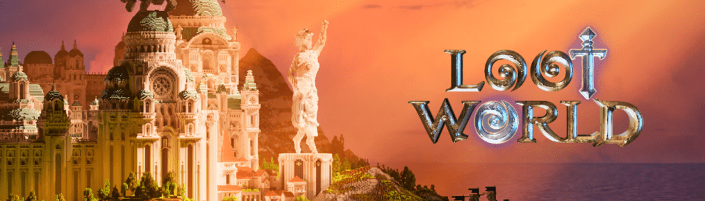

# LootWorld - Wizards

这是 LootWorld 的创世纪系列。 有 8,888 个独特的手绘巫师可用，每个巫师都是由 150 多个特征创建的。 每个巫师都是 LootWorld Metaverse 中的一个可玩角色。早期持有者的好处包括： 进入土地 进入专属区域 免费进入扑克游戏 NFT Staking for $GEMS

关于我们
Wes 和 Phil 创立了该项目，从 2020 年底开始，名为 NFTLootBox.com，现在更名为 LootWorld.io

 从一个简单的 NFT 质押平台转变为用户声称普通、罕见、稀有、史诗、传奇和神话 NFT；生成 NFT 集合，每个集合都是独一无二的，并且具有真正的实用性。

 LootWorld 现在专注于 Metaverse，随着 LootWorld 的开发，这是一个使用Minetest开源体素游戏引擎的幻想主题沉浸式虚拟游戏。

