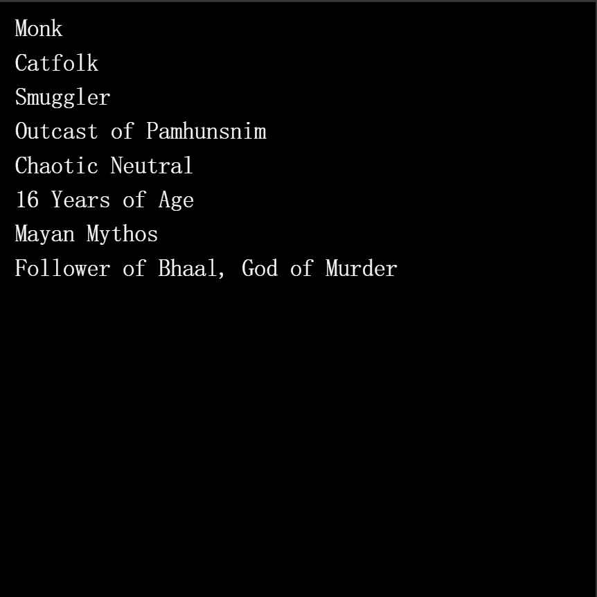

# Lore (for Adventurers)

战利品知识（冒险家）现已上线，战利品持有者可免费领取！

工作有机会成为非熟练、新手、熟练工、专家或大师级别的工作。你可以在宗教上掷出 1 并被你的神诅咒，或者只是一个普通的追随者。如果幸运的话，你会被祝福、被选中，甚至被提升到你神的右手边。你的种族可以被分类为不受欢迎的、公民、声望、贵族或皇室成员。冒险世界很艰难，大多数人最终成为生活在不属于自己的领域的难民。但有些冒险者已经升格为农奴、公民、贵族甚至皇室成员。

某些领域作为您的令牌 ID 的起源城市（从 5% 的现有铸造领域名称中选择）。起源故事。种族。职业。对齐（从 9 个对齐中选择）。年龄 (10 - 109)。万神殿（从对传说友好的 DnD 万神殿中选择）。神/神。

