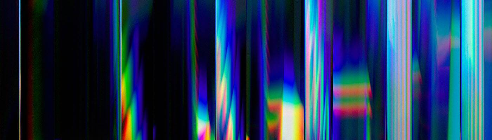

# LOREM 1/1

欢迎来到 OpenSea 上的 LOREM 1/1 之家。 发现这个系列中最好的项目。过去 7 天没有售出 LOREM 1/1。什么是好看的字体？Apercu 之类的东西。关于创作者版税，我错过了什么？

LOREM 1/1 NFT - 常见问题（FAQ）
▶ 什么是 LOREM 1/1？
LOREM 1/1 是一个 NFT（非同质代币）集合。存储在区块链上的数字艺术品集合。
▶ 有多少个 LOREM 1/1 代币？
总共有 3 个 LOREM 1/1 NFT。目前 3 位所有者的钱包中至少有一个 LOREM 1/1 NTF。
▶ 最近卖出了多少个LOREM 1/1？
过去 30 天内售出 0 个 LOREM 1/1 NFT。

