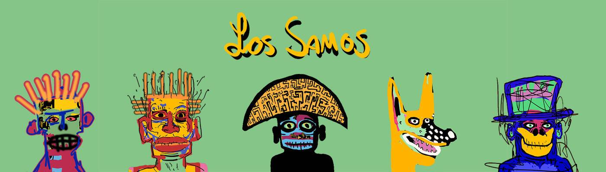

# Los Samos

洛斯萨摩斯是革命者。 他们为言论自由、艺术自由、金融自由和经济自由而战。 它们是多彩的灵魂，模糊了化身和独立艺术之间的界限。 它们以 SAMO 命名，让-米歇尔·巴斯奎特 (Jean-Michel Basquiat) 在开始绘画之前常常在墙上写字。 同样的老狗屎。 作为加密艺术家和 DeFi 信徒，我们不会接受。 是时候做出改变了。 你要成为革命者吗？ 抓住这些美丽的 1:1 艺术作品之一，加入我们的不和谐，看看你在项目中见过的最大的路线图。 非常喜欢

