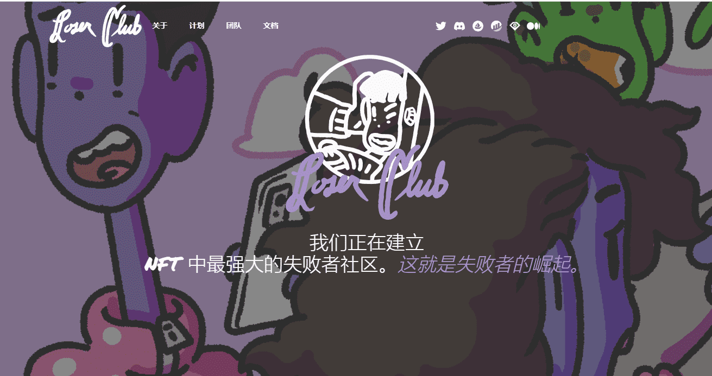

# Loser Club Official

失败者俱乐部。从不酷。从不孤单。艺术家[J'Von](https://twitter.com/itsjvon) aka Catman aka Cool Sweater 的一个项目。在这个新兴的 NFT 空间中，有一件事仍然存在，那就是社区。我们庆祝不符合规范和自发的创造力。让我们成为新的多数。这是失败者的时间。他的目标：卖艺术品，把钱还给持有者，让他们为所欲为，为所有失败者创造一个交流和创造的枢纽。

我们是波西米亚享乐主义者。我们庆祝不符合规范和自发的创造力。对于真正的原始艺术品，真正的效用在于了解艺术家，而决定价值的是人。失败者俱乐部深深植根于逆向主义。反映了今天。作为一个变态。

