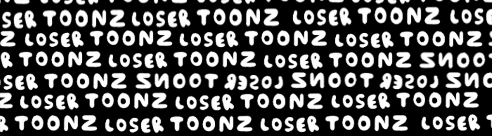

# LOSER TOONZ OFFICIAl COLLECTION

LOSER TOONZ 拥有 2222 个特殊且独特的区块链编号，从 1 到 2222，根据失败者 NFT 的性质，让每个所有者都闪耀、稀有和有价值，而 LOSER TOONZ 的核心是制作 NFT 和真正喜欢它的人。 如果你看到这个解释，你可以路过但是如果你想让人们更多地了解这个 NFT，请随时让他们知道我会振作起来，直到我成为 Open Sea NFT TOP 100 之一，谢谢你的阅读。

LOSER TOONZ 官方合集 NFT - 常见问题 (FAQ)
▶ 什么是 LOSER TOONZ 官方收藏？
LOSER TOONZ OFFICIAL COLLECTION 是一个 NFT（不可替代令牌）集合。存储在区块链上的数字艺术品集合。
▶ 有多少个 LOSER TOONZ OFFICIAL COLLECTION 代币？
总共有 2,223 个 LOSER TOONZ 官方收藏 NFT。目前，18 位所有者的钱包中至少有一个 LOSER TOONZ OFFICIAL COLLECTION NTF。
▶ 最昂贵的 LOSER TOONZ OFFICIAL COLLECTION 销售是什么？
售出的最昂贵的 LOSER TOONZ OFFICIAL COLLECTION NFT 是 LOSER TOONZ #2223。它于 2022-06-12（3 个月前）以 15.3 美元的价格售出。
▶ 最近卖出了多少个 LOSER TOONZ OFFICIAL COLLECTION？
过去 30 天内售出了 41 个 LOSER TOONZ OFFICIAL COLLECTION NFT。
▶ LOSER TOONZ 官方收藏要多少钱？
在过去 30 天内，最便宜的 LOSER TOONZ OFFICIAL COLLECTION NFT 销售额低于 5 美元，最高销售额超过 7 美元。过去 30 天 LOSER TOONZ OFFICIAL COLLECTION NFT 的中位价格为 6 美元。
▶ 什么是流行的 LOSER TOONZ OFFICIAL COLLECTION 替代品？
许多拥有 LOSER TOONZ OFFICIAL COLLECTION NFT 的用户还拥有 Blazed Babez、 Littlz、 Blazed Boyz和 Bored Ape Cannabis Club。

