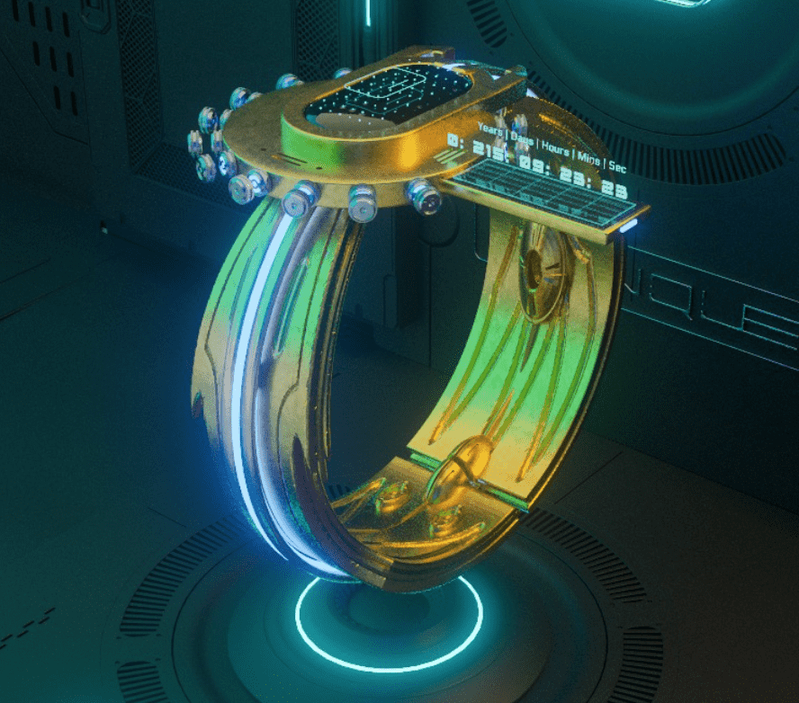

# Lost Children of Andromeda: CYNQUE Prototypes

在 2032 年巴黎被毁后，波尔多博士精心打造了 1,111 个独特的 CYNQUE 原型。

它旨在重新连接人类并取代个人计算，它是一个独立的无信任数据网络，不断分发给所有这些 CYNQUED。

最初是对第一次世界末日事件的少数幸运幸存者的考验，但可能会变得更加……

这 1,111 种不同颜色、纹理、材料和设计元素的技术设备，提供了在未来生存的基本信息。

