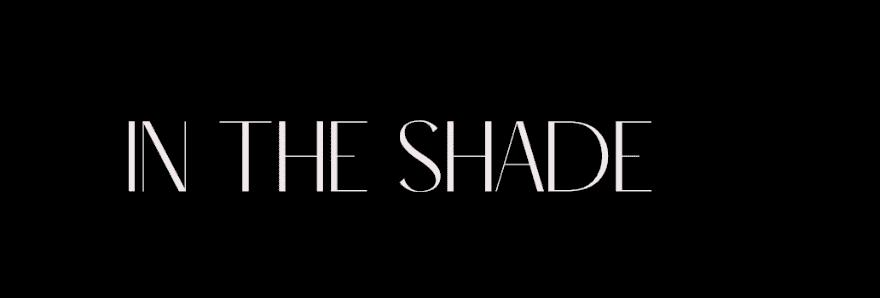

# Lost In The Shade

由人工智能创建的 999 个令人叹为观止的 NFT 将恢复您的新想象力。

迷失在阴影 NFT - 常见问题（FAQ）
▶ 什么是迷路？
Lost In The Shade 是一个 NFT（非同质代币）集合。存储在区块链上的数字艺术品集合。
▶ 有多少个迷失在阴影中的代币？
总共有 999 个 Lost In The Shade NFT。目前，955 位车主的钱包中至少有一个 Lost In The Shade NTF。
▶ 最昂贵的 Lost In The Shade 拍卖会是什么？
最昂贵的 Lost In The Shade NFT 是 Lost In The Shade Hidden。它于 2022-06-10（3 个月前）以 67.4 美元的价格售出。
▶ 最近卖了多少个迷失在阴影中？
过去 30 天内售出了 18 个 Lost In The Shade NFT。
▶ 迷失在阴影中的费用是多少？
在过去 30 天里，Lost In The Shade NFT 最便宜的销售额低于 0 美元，最高销售额超过 27 美元。过去 30 天内，Lost In The Shade NFT 的中位价格为 12 美元。
▶ 有哪些流行的 Lost In The Shade 替代品？
许多拥有 Lost In The Shade NFT 的用户还拥有 MoonKiller Official、 Mythologicals、 Punkers NFT和 VAL | 哈拉。

