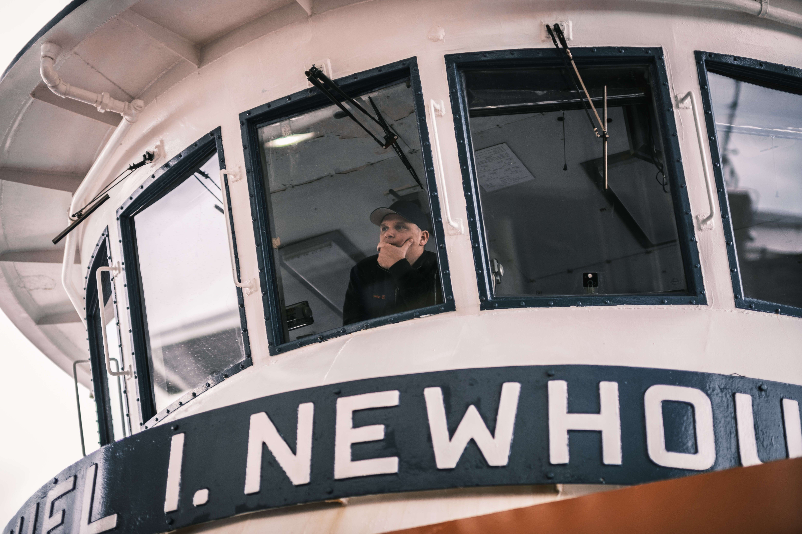

# Lost In Transit

这是我的遗产项目 - 在史泰登岛渡轮上观察人类通勤的艺术十年。

我发现乘船穿越纽约港的旅程是从喧嚣城市的混乱中冥想的休息时间。

登船时，可以感觉到渡轮发动机的振动。当船离开时，您可以听到水拍打船尾的声音。走在甲板上，凝视着浩瀚海洋的地平线，可以是平静而谦卑的。

通过拍摄这些照片，我发现我并不是唯一一个迷失在自己身上的人。这些肖像不再是向外看别人，而是向内看我自己的心灵我将一次丢弃 20 张图片，并且只会在售罄后发布下一批 20 张。

最终集合中将有 5 轮总共等于 100 幅图像我被授予“SONY 年度新锐摄影师”奖，并因这个项目被 Photo District News 和 CNN 报道。

