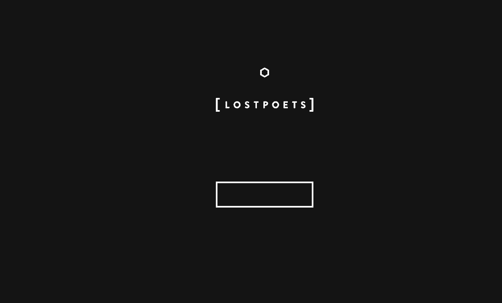

# LOSTPOETS

不再可能将页面转换为诗人。Origin 空投是此旅程的一部分。每天 2 个 Origins 将被丢弃到它们自己的潜伏点中。

“探索者”是收集者发现机制的行为。随着时间的推移，这一行为将揭示其机制，因此不要指望游戏视角会立即发生转变。作为该行为的一部分，将揭示更多特征。

诗人可以用书页来喂养。每个页面都将授予其诗人重命名的权利。重命名权不必行使，并且可能保持未使用状态。页面消费和重命名机制将在 2 周内激活。

每个给定页面出现的单词将由他们的诗人决定。

提供给诗人的每一页都授予该诗人额外的“重写”，这可用于更改诗人的名字或重写一首诗。送给诗人的每一页都会随机生成 2 到 4 个单词。

你的诗人的独特性将被他们的话语改变。其中一些稀有物品将立即被披露，而另一些则将继续隐藏。你会选择因你所产生的意义而被理解和重视，还是为了与众不同而宁愿变得毫无意义？

探险家的冒险仍在继续。

