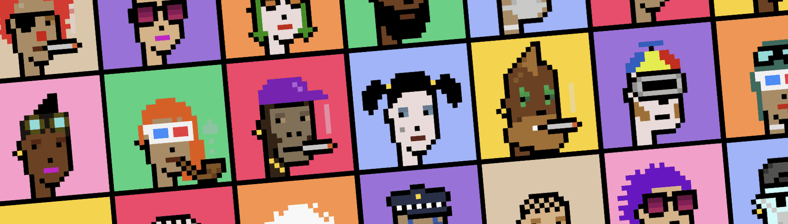

# Lost Punk Society

欢迎来到失落的朋克协会，原始 CryptoPunks 的后代聚集在这里分享他们丰富多彩的故事。 新成员只能由同时拥有父亲朋克和母亲朋克的人添加。 但要小心！ 任何一个朋克都不能有两个以上的孩子，父母不能有密切的关系。⚠️ 如果您决定购买一个失落的朋克并打算从中铸造更多的孩子，您应该在完成购买之前检查之前铸造了多少个孩子， 通过将令牌 ID 输入到 Etherscan 上的 punkAttributes 函数中。元数据和图像完全生成并存储在链上。 铸造成本每代增加 0.05E（如果父母都是 CryptoPunks，则免费），其中 10% 捐赠给 GiveDirectly.org。兄弟姐妹会分道扬镳多年后团聚吗？ 双胞胎多久会出现一次？ 我们会看到丢失的外星人或猿类吗？ 我们会冒僵尸出没的风险吗？ 只有时间会证明...灵感来自 LarvaLabs（非附属）。

