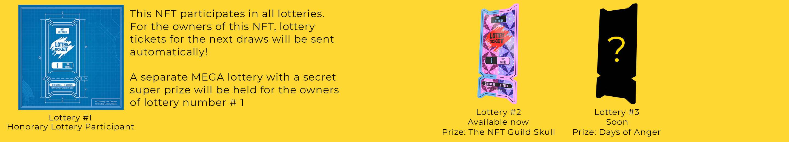

# Lottery

这个彩票 NFT 集合。 我们寻找独特的画作并在我们的成员中播放。 彩票本身已经是一件艺术品。 获胜者将使用特殊程序随机确定。 我相信很快Ape Lottery Ticket NFT - 常见问题（FAQ） 过去 7 天没有售出 Lottery

Lottery  NFT - 常见问题（FAQ）

▶ 什么是Lottery？

Lottery是一个 NFT（Non-fungible token）集合。存储在区块链上的数字艺术品集合。

▶ Lottery 代币有多少？

总共有 30 个 Lottery NFT。目前 3 位所有者的钱包中至少有一张Lottery NTF。

▶ 最近卖出了多少Lottery？

过去 30 天内共售出 0 张 Lottery NFT。与者的奖品将是 Beeple 和 CryptoPunk ！！！

