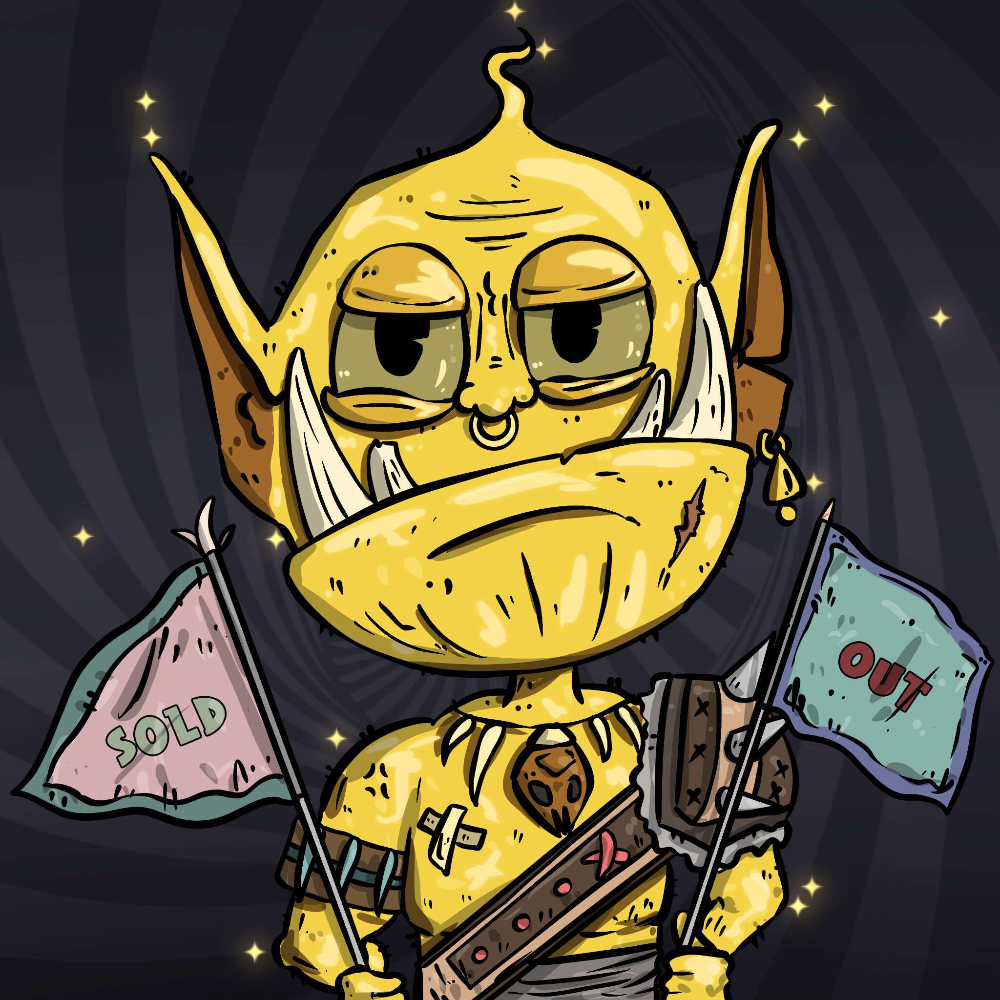

# lotterygoblin

lotterygoblin NFT 在过去 7 天内售出 1 次。lotterygoblin 的总销售额为 0.22 美元。一张彩票地精 NFT 的平均价格为 0.2 美元。共有 5,112 名彩票妖精拥有者，总共拥有 9,989 个代币。

什么是彩票妖精？

lotterygoblin 是一个 NFT（非同质代币）集合。存储在区块链上的数字艺术品集合。

有多少彩票妖精代币？

总共有 9,989 个 lotterygoblin NFT。目前，5,112 名所有者的钱包中至少有一个彩票地精 NTF。

什么是最昂贵的彩票地精销售？

售出的最昂贵的 lotterygoblin NFT 它于 2022 年 6 月 27 日（2 个月前）以 0.2 美元的价格出售。

最近卖出了多少个乐透妖精？

过去 30 天内售出了 3 个 lotterygoblin NFT。

