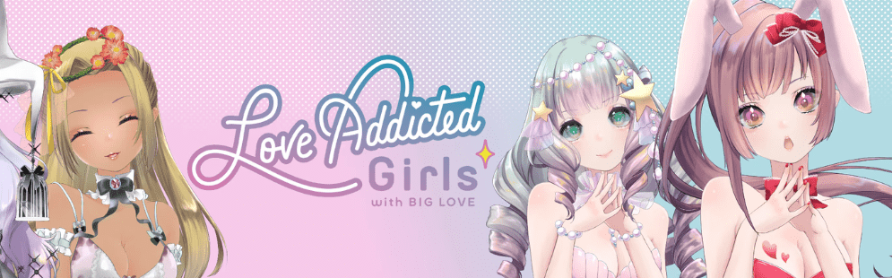

# Love Addicted Girls

“Love Addicted Girls with BIGLOVE”（LAG）系列是由 Soudan NFT 社区在以太坊区块链上用爱制作的 4,000 件受日本启发的独特数字独家收藏品。 您的 LAG NFT 是您对 Soudan Exclusive Member-only 合作伙伴关系、福利和福利的独家访问。 更多福利将通过社区路线图激活来实现。 访问 https://lag.soudan-nft.xyz/ 了解更多详情。

过去 7 天，Love Addicted Girls NFT 共售出 117 次。Love Addicted Girls 的总销售额为 $17.27k。一个 Love Addicted Girls NFT 的平均价格为 147.6 美元。有 2,255 名 Love Addicted Girls 拥有者，拥有 4,000 个代币的总供应量。

爱上瘾的女孩 NFT - 常见问题（FAQ）
▶ 什么是爱上瘾的女孩？
Love Addicted Girls 是一个 NFT（不可替代代币）系列。存储在区块链上的数字艺术品集合。
▶ 有多少 Love Addicted Girls 代币？
总共有 4,000 个 Love Addicted Girls NFT。目前，2,255 位所有者的钱包中至少有一个 Love Addicted Girls NTF。
▶ 最昂贵的 Love Addicted Girls 特卖会是什么？
售出的最昂贵的 Love Addicted Girls NFT 是 LAG#1641。它于 2022 年 6 月 21 日（2 个月前）以 1.1 万美元的价格售出。
▶ 最近卖了多少爱上瘾的女孩？
过去 30 天共售出 606 个 Love Addicted Girls NFT。
▶ 一个爱上瘾的女孩需要多少钱？
过去 30 天，Love Addicted Girls NFT 最便宜的销售额低于 62 美元，最高销售额超过 216 美元。过去 30 天，Love Addicted Girls NFT 的中位价格为 132 美元。
▶ 什么是流行的 Love Addicted Girls 替代品？
许多拥有 Love Addicted Girls NFT 的用户还拥有 Neo Samurai Monkeys、 Pixel Crypto Ninja Heroes、 ZQN！你的心中。和 花洛丽塔系列。

