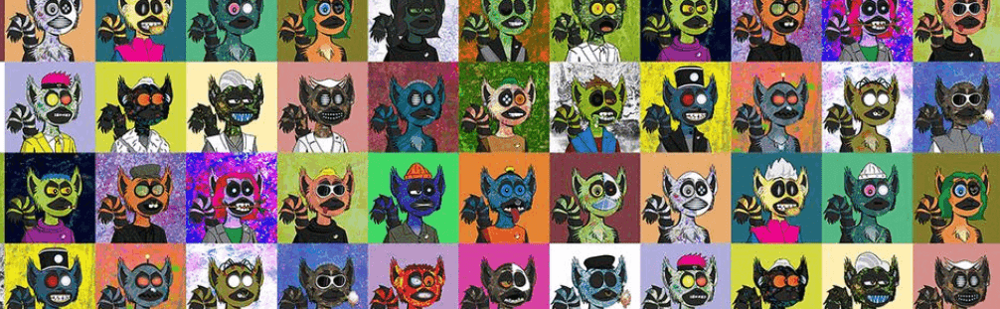

# Love Lemurs & Robots

Love Lemurs + Robots 集合了 12,000 个独特的可收藏艺术代币，结合了狐猴、技术和图案。 大量的特征使每件作品都独一无二。 具有 1、2 或 3 个以 bot 结尾的特征的网络狐猴是最稀有的，特别是当机器人特征匹配时（例如 lazerbot、Ledbot ...）• 限量版网络狐猴 #1 至 #5500• 独特的 1/1 网络狐猴 #5501 到 #12000 每个 1,000 件的衍生项目正在进行中，请关注 twitter 和 instagram 页面以获取更多信息！

Love Lemurs & Robots NFT - 常见问题（FAQ）
▶ 什么是爱狐猴和机器人？
Love Lemurs & Robots 是一个 NFT（不可替代代币）系列。存储在区块链上的数字艺术品集合。
▶ 有多少个 Love Lemurs & Robots 代币？
总共有 12,000 个 Love Lemurs & Robots NFT。目前，53 位车主的钱包中至少有一个 Love Lemurs & Robots NTF。
▶ 最近卖出了多少Love Lemurs & Robots？
过去 30 天内共售出 0 个 Love Lemurs & Robots NFT。

