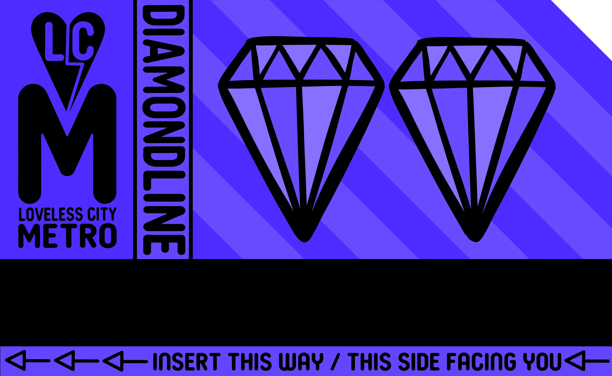

# Loveless City Metropass NFT

MetroPass 总供应量：3333

截至 22 年 8 月 9 日的 Metropass 总质押数：2407/3333 (72.2%)

MetroPass 是您获得公民身份的钥匙！持有人将享受各种实用程序。

艺术家：Tennessee Loveless 之前曾为 Google、Sony、Casio、Apple 和许多其他主要品牌工作过。他还受迪斯尼委托创作了 10x10x10 系列，其中包括以迪斯尼标志性人物米老鼠为重点的各种作品。

Tennessee Loveless 是一位来自伊利诺伊州芝加哥的美国流行音乐和都市民俗艺术家，以其充满活力的几何景观和丰富多彩的故事讲述而闻名，由于他的色盲，田纳西州的作品带有某种讽刺意味。

