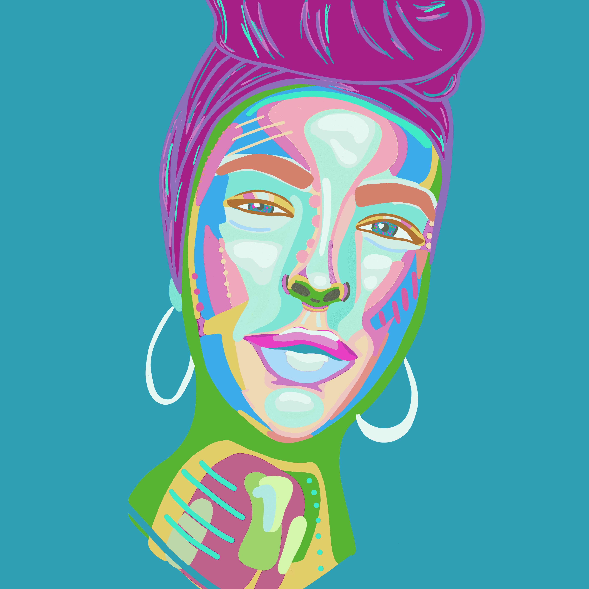

# Love Thy Self 3 Part Art & Poem Series. A Be Coded By Colour Series.

自我价值是我们在地球上生活的一个组成部分，当我们开始看到并承认我们灵魂的颜色时，它就会出现。“颜色”是构成我们精神代码的独特元素的隐喻表达，是我们作为个体的关键以及我们与生活互动的特殊方式。本系列通过使用创作者爱夫人的色彩、俳句和沉思，探索重新编码自我价值的过程和工具。

嗨，我的名字是爱夫人。又名凯拉。澳大利亚总部。艺术家和摄影师。

