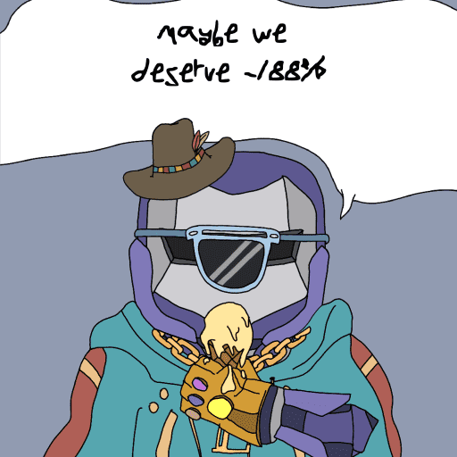

# Lunatic Support Group (LSG)

Lunatic Support Group (LSG) 是一个由 3,333 个 NFT 组成的集合，旨在将看到他们的储蓄因 TerraUSD/LUNA 崩盘而被剥夺的社区聚集在一起。

▶ 什么是疯人支持小组 (LSG)？
Lunatic Support Group (LSG) 是一个 NFT（不可替代代币）集合。存储在区块链上的数字艺术品集合。
▶ 有多少个 Lunatic Support Group (LSG) 代币？
总共有 865 个 Lunatic Support Group (LSG) NFT。目前，110 位所有者的钱包中至少有一个 Lunatic Support Group (LSG) NTF。
▶ 最昂贵的 Lunatic Support Group (LSG) 销售是什么？
最昂贵的 Lunatic Support Group (LSG) NFT 是 Lunatic Support Group #211。它于 2022-06-07（3 个月前）以 7.1 美元的价格售出。
▶ 最近卖出了多少个 Lunatic Support Group (LSG)？
过去 30 天内售出了 1 个 Lunatic Support Group (LSG) NFT。

