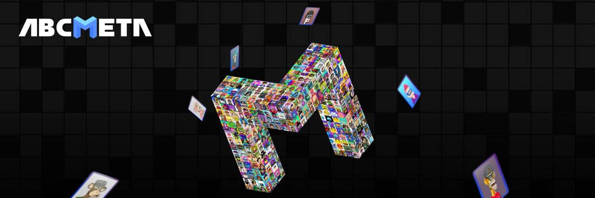

# LT-META-PASS

ABCMETA.io是一个NFT资产铸造和交易的全球平台，项目提供“Bid-to-Earn”拍卖模式，是进入元界的全新入口。

参与“USDA流动性挖矿”的参与者将获得USDT的奖励。

参与者还将获得 10 个免费铸币厂 ABCMETA-ID，一个像素化的 NFT，并享受永久版税。

只需伸出手进入 ABCMETA。

▶ 什么是 LT-META-PASS？
LT-META-PASS 是一个 NFT（Non-fungible token）集合。存储在区块链上的数字艺术品集合。
▶ 存在多少个 LT-META-PASS 代币？
总共有 1 个 LT-META-PASS NFT。目前，5,983 位所有者的钱包中至少有一个 LT-META-PASS NTF。
▶ 什么是最昂贵的 LT-META-PASS 销售？
售出的最昂贵的 LT-META-PASS NFT 是 AIRDROP-PASS（价值高达 5,000 USDT）。它于 2022 年 6 月 25 日（2 个月前）以 4.5 美元的价格售出。
▶ 最近卖出了多少 LT-META-PASS？
过去 30 天内售出了 2 个 LT-META-PASS NFT。

