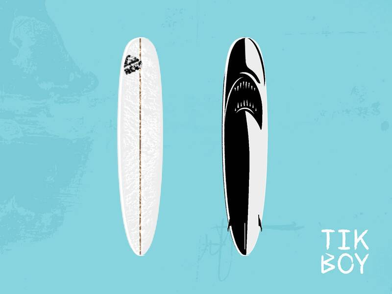

# LU Surf Club

每个冲浪小镇都有自己的塑造者。Elyu 有 Larry “Tikboy” Hufalar。  

LU SURF CLUB Genesis drop 是一系列数字冲浪板，基于“Tikboy”为 Elyu 最著名的冲浪者手工塑造的冲浪板。 

虽然它们本身就是具有收藏价值的艺术品，但每块冲浪板也让其拥有者可以进入传说中的 Elyu 冲浪领域，*lRL*。

这些 NFT 还可以作为您在菲律宾最成熟的冲浪社区之一的会员卡。无论是在海上还是在水中，它们都让您可以畅游 Elyu 的最佳景点。到您访问时，您不仅会成为当地冲浪社区的骄傲成员，而且当您离开时，您也会站在冲浪板上！

