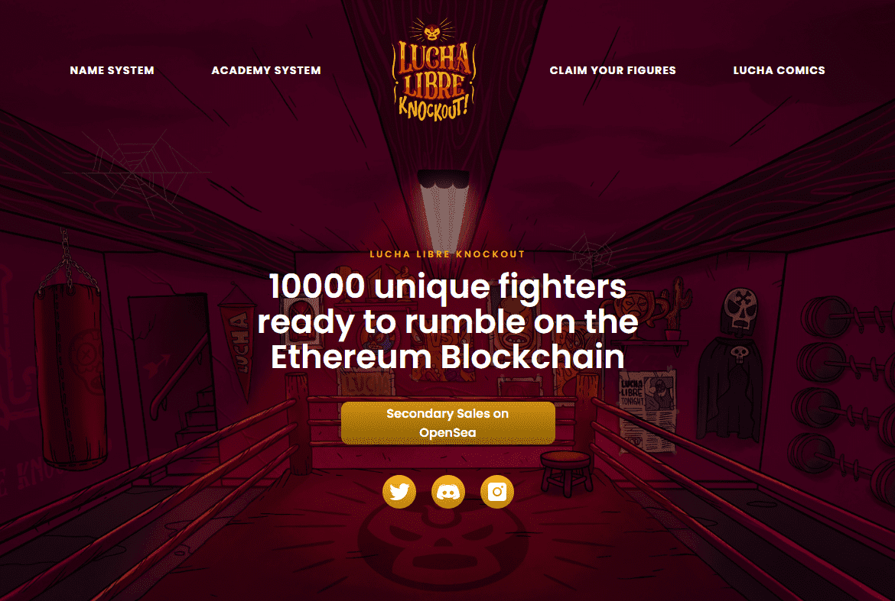

# Lucha Libre Knockout

Lucha Libre Knockout NFT 在过去 7 天内售出 3 次。Lucha Libre Knockout 的总销售额为 31.5 美元。Lucha Libre Knockout NFT 的平均价格为 10.5 美元。共有 3,134 名 Lucha Libre Knockout 所有者，拥有 10,000 个代币的总供应量。

街区中最糟糕的六所学院将让他们最无情的战士参加 Lucha Libre Knock Out，这是世界上最大、最残酷的摔跤比赛。LLKO 是 10,000 个 Luchadores NFT 的集合 - 生活在以太坊区块链上的独特 ERC721 收藏品。每个 Luchador 将代表这六个学院之一。准备好说话，甩泥和摔肘，因为它即将下降！你有资格称自己为 Luchador 吗？

