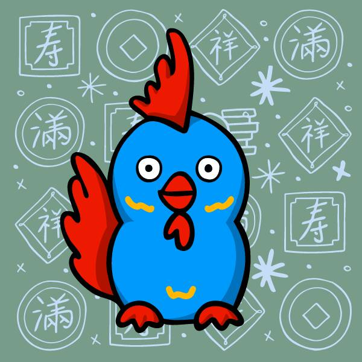

# Luckies

Luckies 通过我们在 OddFutur3 和全球知名艺术家 Sophia Chang 之间设计的数字红包 🧧 作为 NFT 来庆祝亚洲文化。

以太坊区块链上使用 ERC-1155 标准的 8,888 个独特的 NFT。100% 手绘生肖字符以庆祝繁荣和奉献文化。100% 手绘生肖字符以庆祝繁荣和奉献文化。建立在以太坊区块链上的独特的生成艺术。

每个 Luckies NFT 都由一百多种独特特征的不同组合组成，使用 ERC-1155 标准建立在以太坊区块链上。通过铸造 1:1 Luckies NFT，我们欢迎您加入我们神圣的大家庭。享受无限红包的礼物，一个充满有趣惊喜和好运的代币。

