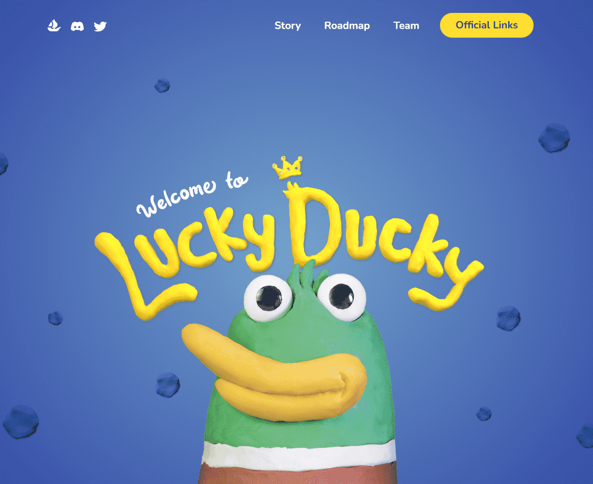

# Lucky Ducky NFT

7,777 只 Lucky Duckies 离开了池塘并开始恶作剧！

以太坊上第一个家庭友好的手工粘土生成项目！

Lucky Ducky 的每个元素最初都是一个简单的粘土球，手工制作成这些小鸭子，并通过粘土化的魔力赋予生命。每只铸造的幸运鸭子都受到所有年龄段的人的赞赏，无论大小。所有资产和特征都经过家庭批准！

Lucky the Ducky 因摆脱困境而闻名于池塘。有一天，在同一个老水坑里游泳感到无聊后，他制定了一个计划。他说：“让我们找个伪装，搞点恶作剧吧，幸运鸭朋友们！”

很快你就可以铸造你自己的 Lucky Ducky NFT 并跟随 Lucky Ducky 和每一个淘气的 Ducky 的冒险......

