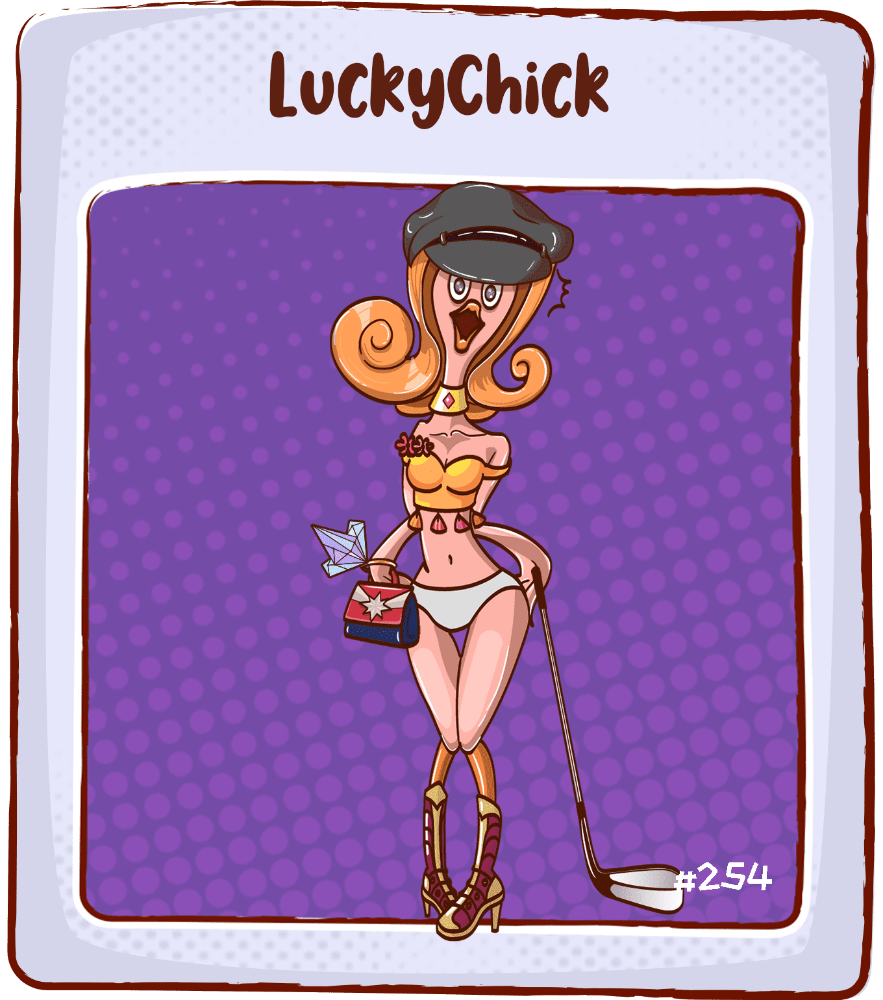

# LoserChick-LuckyChick

LuckyChick很漂亮，过着舒适的生活，但她必须陪伴她不喜欢的人，每天都在傻笑，她只能通过尖叫来表达自己的不满。这种力量比特朗普、老板和工党都要强大。

LoserChick 是全球首款链上游戏《爪鹤》，由 Emoji DAO 打造，属于社区的游戏，无私募，无资本，所有 $CHICK 以公平发射。

抓蛋、盲盒、造币NFT、NFT挖矿……在LoserChick，你不仅可以享受抓鹤、开盲盒的快感，还可以获得NFT挖矿的收益。

▶ 什么是LoserChick-LuckyChick？
LoserChick-LuckyChick 是一个 NFT（Non-fungible token）集合。存储在区块链上的数字艺术品集合。
▶ 有多少个 LoserChick-LuckyChick 代币？
总共有 283 个 LoserChick-LuckyChick NFT。目前 10 位所有者的钱包中至少有一个 LoserChick-LuckyChick NTF。
▶ 最近卖出了多少LoserChick-LuckyChick？
过去 30 天内售出 0 个 LoserChick-LuckyChick NFT。

