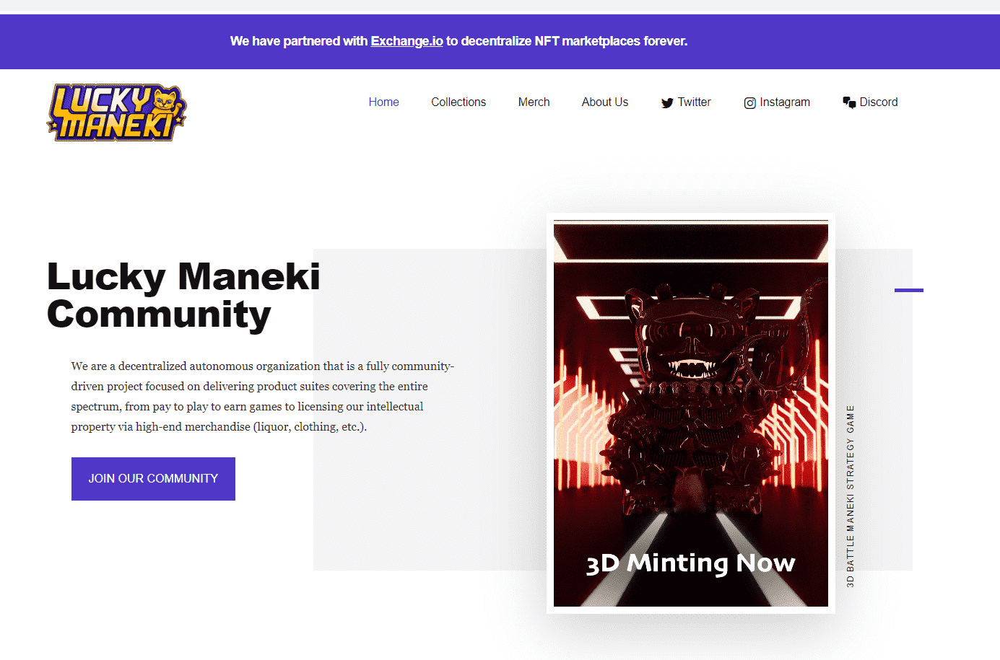

# Lucky Maneki

Lucky Maneki NFT 在过去 7 天内售出 10 次。Lucky Maneki 的总销售额为 121.95 美元。一个 Lucky Maneki NFT 的平均价格为 12.2 美元。有 3,130 名 Lucky Maneki 所有者，总共拥有 14,216 个代币。

以日本招财猫为模型，14,159 只招财猫是由数百个特征的随机组合以编程方式生成的。这些精美的艺术品以 ERC-721 代币的形式存在于以太坊区块链上。您的 Lucky Maneki 充当治理代币，因此您可以对项目的未来方向进行投票，并授予会员专享福利，其中第一个是对挑战的访问。

