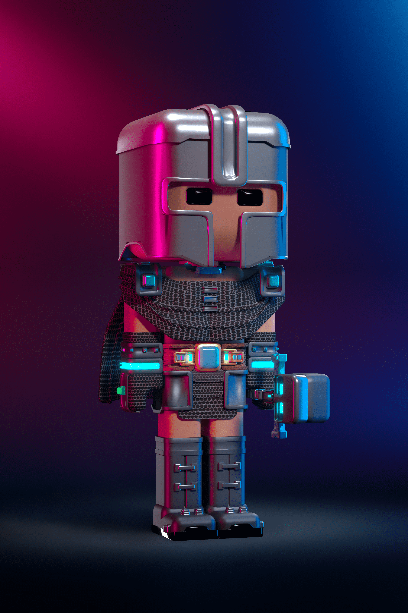

# Lulupunk

LuluPunk 是一组独特的虚拟形象艺术品。目前有9999个。LuluPunk 由算法生成，将成为虚拟世界、游戏和 VR 的 3D 化身。您的 LuluPunk 兼作您的 LuluPunk 俱乐部会员卡。

LuluPunk 人物由圆角矩形组成，这使得 LuluPunk 与其他 IP 不同。这种简单的造型风格很容易被电脑处理和展示，可以成为流行和经典的风格。

LuluPunk 人偶非常稀有且库存有限。在以太坊的智能合约中，根据 ERC721 标准，总共铸造了 9999 个数字，以递增的价格进行拍卖。每年新增 12 位 LuluPunk 人物，LuluPunk 社区的活力和影响力不断增长。

