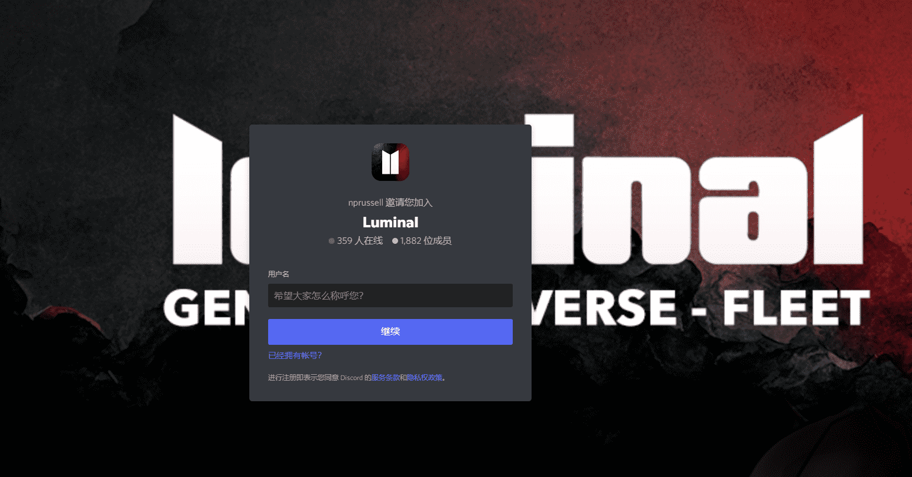

# Luminal Genesis

Luminal Genesis 本质上是 nprussell 的一个充满激情的项目。它是由 AI 生成并由艺术家修改/改进的 444 个外星世界的集合。最初的目标是在 NFT 领域创建最一致和最受人尊敬的 AI 艺术收藏品之一。Luminal Genesis 远不止于此。Luminal Genesis NFT 是后续一切的门票/钥匙，并将在某种程度上用于所有未来的实用程序。您当然可以成为 Luminal 社区的一员，并在不持有 Genesis 的情况下加入所有后续活动，但随着项目的发展，Genesis 持有者将始终从更广泛的项目中受益。

对 Genesis 持有者的一些好处（请注意，此列表不是绝对的，并且会随着时间的推移 100% 增长）：

Luminal Universe 的免费铸币（每个 Genesis NFT 拥有 1 铸币） 免费铸币给 nprussell 的所有未来工作（已经从 AI Everyday 开始） 独家白名单和奖品赠品

