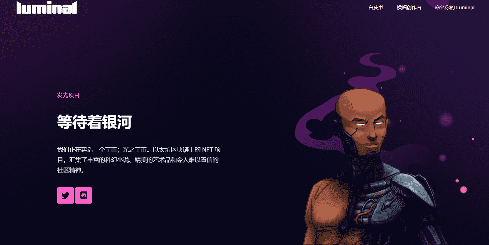

# Luminal Universe

Luminal Universe 是 Luminal 项目的第 2 阶段：1444 个字符 NFT 的集合，由原始集合的 444 个创世纪世界中存在的 4 个物种和 7 个派系组成。

Luminal Universe NFT 充当角色/化身，参与项目后续的所有活动，包括 Luminal Galaxy 在线 RPG。

角色艺术作品：TheArtistSpud 背景和艺术指导：nprussell。

我们正在建造一个宇宙；光之宇宙。以太坊区块链上的 NFT 项目，汇集了丰富的科幻小说、精美的艺术品和令人难以置信的社区精神。

