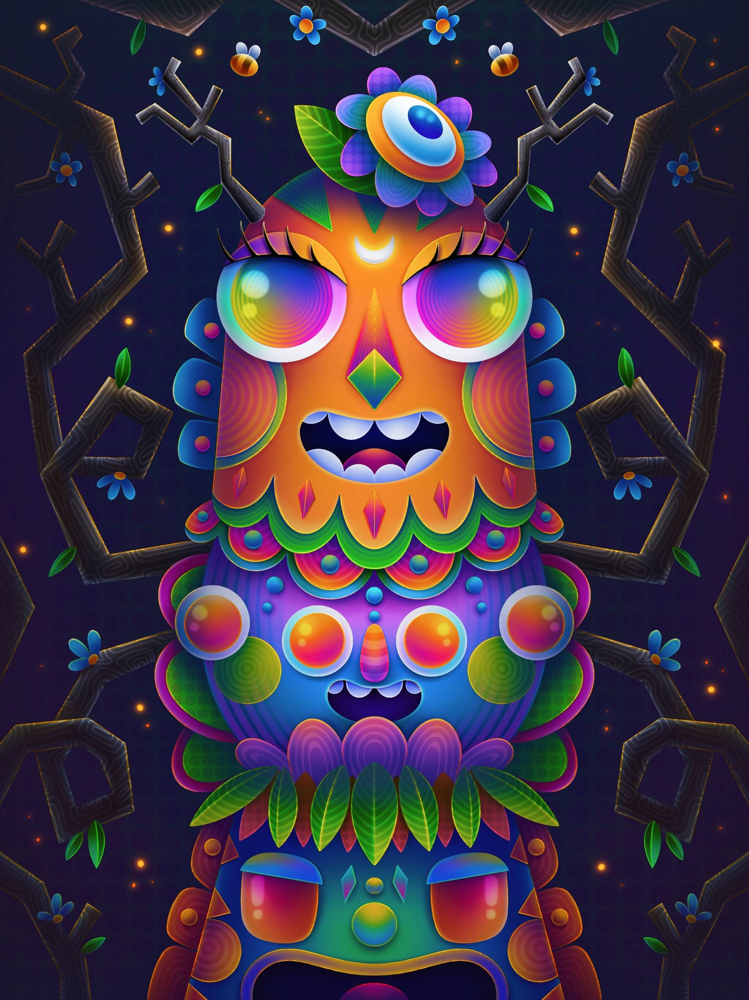

# Luna's Editions

该系列是在“Luna's Editions”智能合约上重新创建的，其中部分已迁移并空投给当前持有者。

“如果我有自己的世界，一切都将是无稽之谈。什么都不会是它的样子，因为一切都会是它不是的样子。相反，它不会是什么。什么不是是的，它会的。你明白吗？

Luna Leonis 的版本。

▶ 什么是 Luna 的版本？
Luna's Editions 是一个 NFT（非同质代币）集合。存储在区块链上的数字艺术品集合。
▶ 有多少个 Luna's Editions 代币？
总共有 7 个 Luna's Editions NFT。目前，61 位所有者的钱包中至少有一个 Luna's Editions NTF。
▶ 最昂贵的 Luna's Editions 销售是什么？
Luna's Editions NFT 售出的最昂贵的是 You are your own hero。它于 2022 年 6 月 28 日（2 个月前）以 109.8 美元的价格售出。
▶ 最近售出了多少 Luna's Edition？
过去 30 天内售出了 8 个 Luna's Editions NFT。

