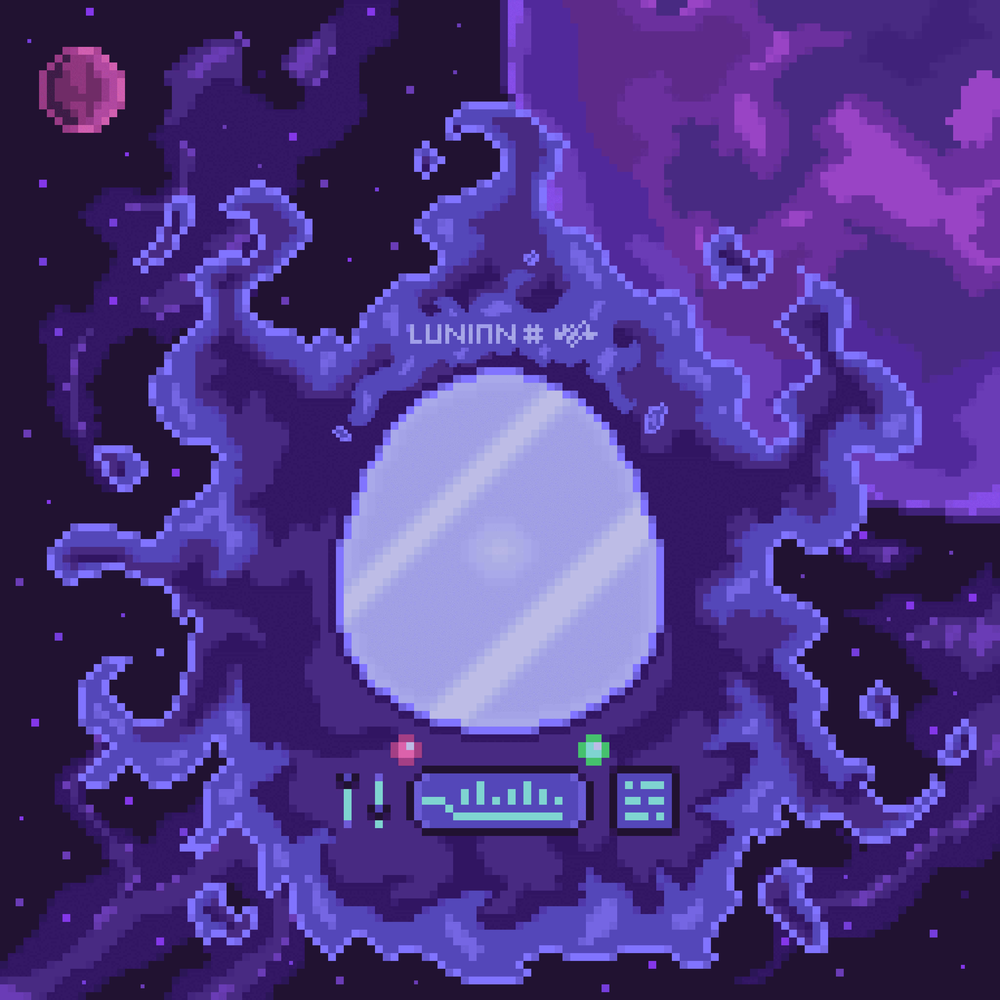

# Lunians

欢迎来到卢尼亚。

卢尼亚人的土地，是在一个原始黑洞自身坍缩时形成的。渐渐地，这个星球似乎正在揭示它的许多秘密......

种子荚
豆荚是月人从黑洞中逃脱的胶囊。了解您可以在 Lunia 找到的两种种子荚。

Lunians从孵化的种子荚中出来，呈现出不同的外观和属性。它们有 12 个身体部位，每个部位都有许多可能的变化，提供数百万种不同的组合。

其他优势
在多边形中孵化 - 几乎没有汽油费

持有者拥有其 NFT 的图像权

通过 IPFS 分散托管元数据

实用性 - 持有 NFT 时的优势、奖励和津贴

Frozen metadata - 你的 NFT 链接的元数据永远不会改变

