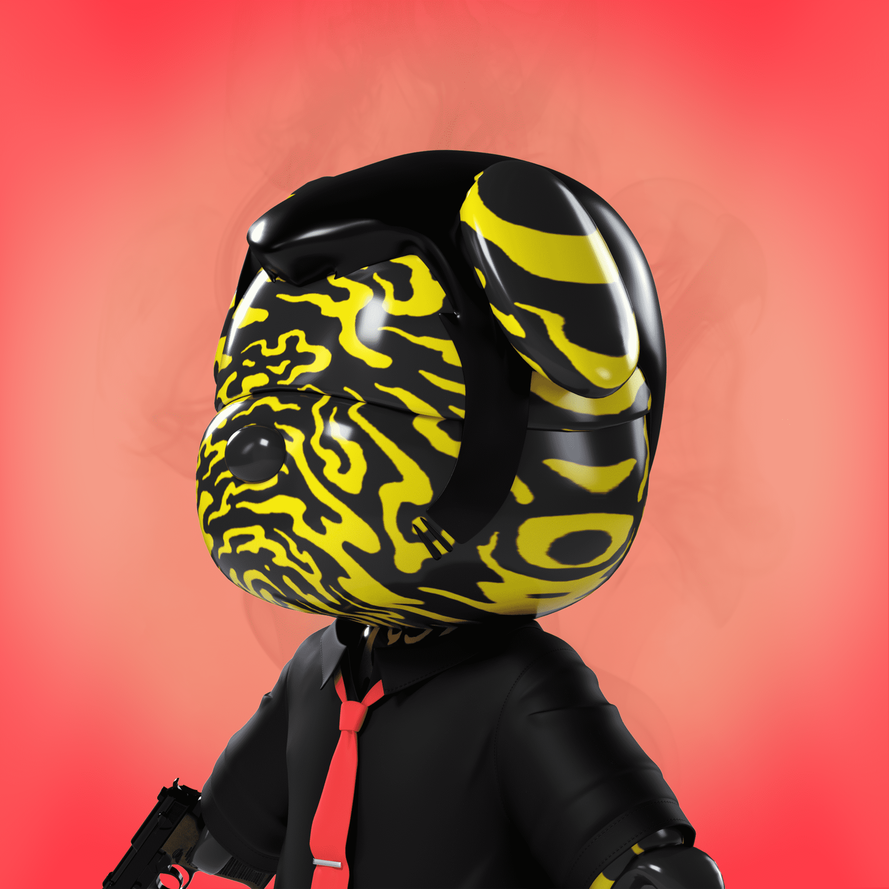

# LUPIN THE III RD x MetaSamurai

web3创意工作室1Block创作的“MetaSamurai”与产生Lupin Ⅲ及其帮派起源的“LUPIN THE ⅢRD”系列（导演：Takeshi Koike）的合作。该系列由受 Lupin、Jigen 和 Goemon 启发的 3DCG 化身组成。1BLOCK的头像项目，无限可能。 MetaSamurai 是由 1BLOCK 呈现的 3,398 个集体 1/1 3D 化身的集合，1BLOCK 是一个位于洛杉矶和东京的创意团队，为创作者提供支持并开发和运营 web3 项目。

（Genesis ZERO/45 台、Genesis/20 台、Main/3,333 台）

“我有你的支持”这句话最能表达元武士支持他们主人的愿望。最初，这句话来自两个人在战斗中背靠背站着保护对方的故事。遵循武士道武士守则的武士，以自己的生命为代价保护了他们的主。使用狗作为主题的灵感来自忠诚的狗八公，它在主人归来时去迎接主人，并在主人去世后留在主人身边长达 10 年。

