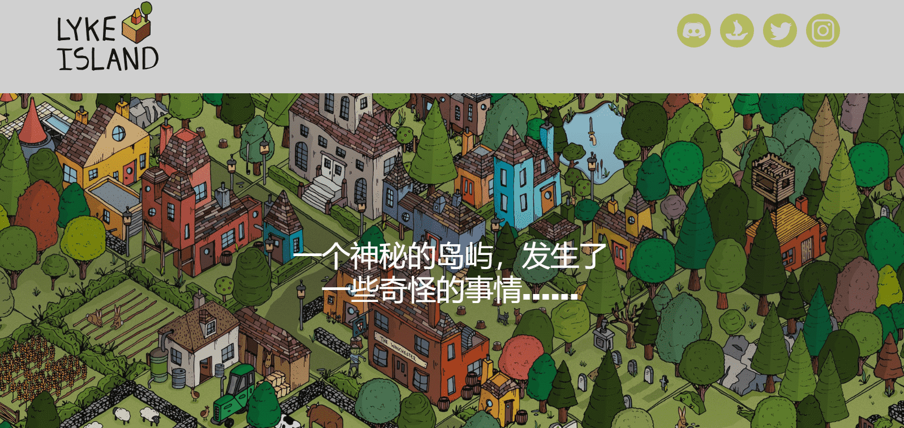

# LykeIsland

来自莱克岛的 120 个独特的手绘动画情节，莱克岛是一个神秘的虚构岛屿，发生了一些奇怪的事情。

你有没有想过莱克岛人长什么样？你有没有想过他们都去了哪里？加入我们，继续拼凑莱克岛的故事......

GEN2 将探索莱克岛的居民（人、动物、神话生物、超自然现象）……以及岛上发生神秘事件后他们去了哪里。

有 2022 名居民。有些是完全手工制作的，有些是由各种手绘特征组成的。

除了属于许多“氏族”之外，该系列还包括许多 1/1 和稀有个体（人、动物、神话生物、超自然、外星人），其中一些属于一个家庭或群体。

