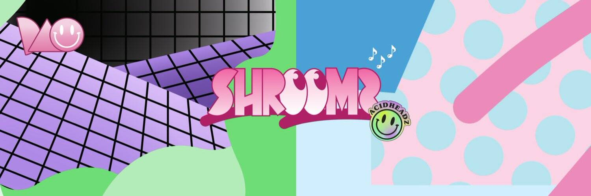

# Lysergic Labs Acidheadz

ACIDHEADZ 是 2,690 个 3D 动画小瓶液体 LSD 的集合，带有自定义音乐！
ACIDHEADZ 具有 94 种视觉特征和 21 种自定义曲调。
ACIDHEADZ 以 ERC721 代币的形式存储在以太坊区块链上，可以以 .mp4 和 .png 格式下载。
ACIDHEADZ 由数十亿种可能的视听组合通过算法生成。
ACIDHEADZ 将于世界标准时间 2021 年 11 月 6 日下午 3 点在我们的网站上铸造，价格为 Ξ0.69...或...通过燃烧一个 SHROOMZ！
Daniel Aristizábal Arias、Symmetric Vision和Penfold 先生的作品。来自世界各地的音乐家的曲调！
90 ACIDHEADZ 将保留用于营销、促销、赠品和团队。
加入我们，向这个传奇的迷幻音乐致敬，沉浸在 90 年代锐舞文化的喜悦中。

