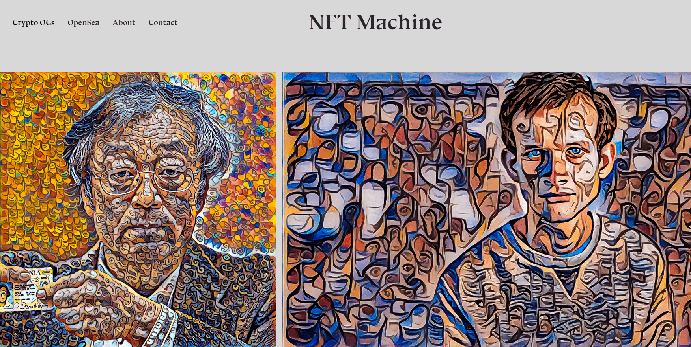

# NFTmachine - Crypto OGs

所有 1/1 作品均使用风格转移神经网络完成。NFTmachine 的第一个系列。

所有艺术作品都是特定加密影响者的 1/1，永远不会使用我的风格转移方法重新创建。

用户和收藏家可以使用 etherscan 直接与链上的艺术品进行交互。遵循相当标准的 ERC-721 实施并提供稀缺性保证。

以人工智能为媒介的数字艺术家。以前在金融方面接受过培训，可以使用神经网络来完成诸如追逐阿尔法之类的令人心碎的任务。我决定退出金融行业，将我的神经网络用于更人性化的事物——艺术。 

