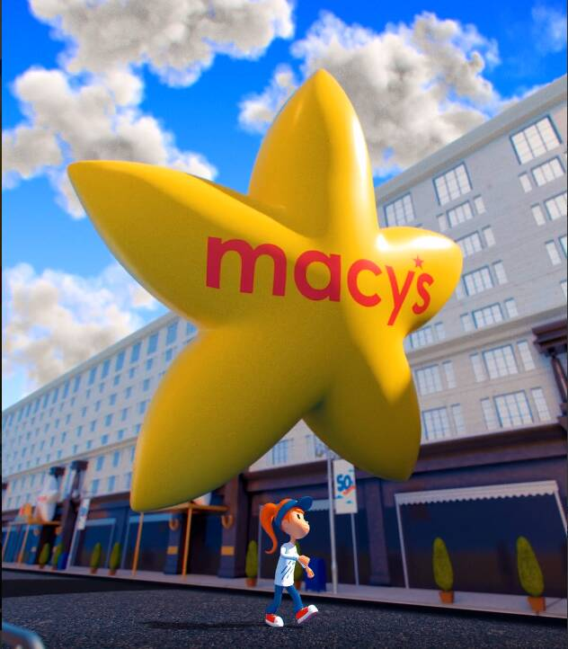

# Macys Thanksgiving Day Parade

Macys Thanksgiving Day Parade NFT 在过去 7 天内售出 13 次。梅西百货感恩节游行的总销售额为 552.19 美元。Macys 感恩节游行 NFT 的平均价格为 42.5 美元。有 7,833 名 Macys 感恩节游行所有者，拥有 9,500 个代币的总供应量。

梅西百货举世闻名的节日活动庆祝其成立 95 周年，特别赠送 9,500 件免费 NFT 艺术品，其中包括来自其丰富遗产的标志性气球，以支持 Make-A-Wish®。

▶ 什么是梅西百货感恩节游行？
Macys Thanksgiving Day Parade 是一个 NFT（非同质代币）系列。存储在区块链上的数字艺术品集合。
▶ 梅西百货感恩节游行代币有多少？
总共有 9,500 个 Macys 感恩节游行 NFT。目前，7,833 名业主的钱包中至少有一份梅西百货感恩节游行 NTF。
▶ 最昂贵的梅西百货感恩节游行促销是什么？
售出的最昂贵的 Macys Thanksgiving Day Parade NFT 是 Macy's Thanksgiving Parade #2459。它于 2022-06-18（2 个月前）以 137.2 美元的价格售出。
▶ 最近卖出了多少梅西百货感恩节大游行？
在过去 30 天内，Macys 感恩节游行 NFT 共售出 23 个。

