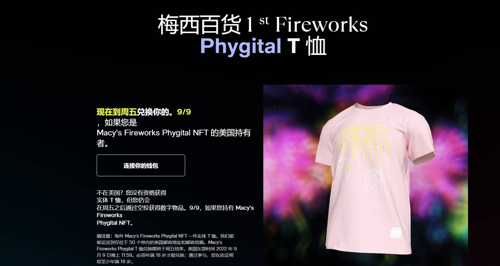

# Macy's Fireworks AR Art Mask

为庆祝梅西百货第 46 届年度 7 月 4 日盛会而创建的 10,000 个 NFT 集合。NFT 可用于经典、稀有和超稀有设计，并展示标志性事件的艺术可视化。每个 NFT 都添加了实用程序，包括通过 Snapchat 访问可在 Snapchat、Microsoft Teams 和 Zoom 上使用的增强现实可穿戴设备的能力。

现在到周五兑换你的。9/9，如果您是Macy's Fireworks Phygital NFT 的美国持有者。不在美国？您没有资格获得实体 T 恤，但您仍会在周五之后通过空投获得数字物品。9/9，如果您持有 Macy's FireworksPhygital NFT。

