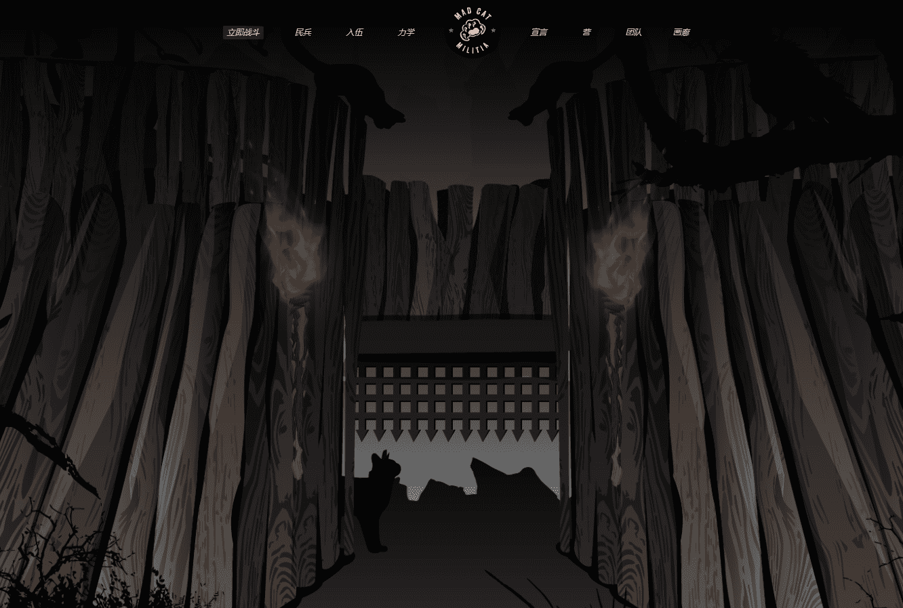

# Mad Cat Militia Cattery

公共铸币厂现已关闭。您可以在我们的二级市场上购买猫。

自从互联网诞生以来，猫就独自行走，成为网络领域的统治者。这个统治是通过深网控制的，由十只传说中的“疯猫”主持。

2021年，一切都变了。

猫科动物国家变得自满了。在阴影中，王位的觊觎者聚集在一起。朋克、hashmasks、猿甚至其他猫渗透到政治体系中并采取了行动。

不知从何而来，这些疯猫因没有犯下的罪行被军事法庭送进监狱。

不久之后，他们逃到了他们留下的冥界，作为幸运的士兵幸存下来。

现在，他们来了……把这一切都收回来。

这就是疯猫民兵。

