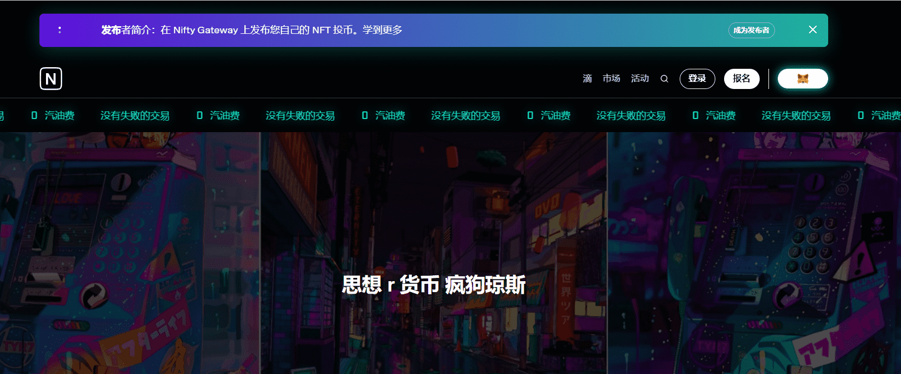

# Mad Dog Jones

Michah Dowbak aka Mad Dog Jones 是来自安大略省桑德贝的多学科艺术家。他的作品巧妙地将赛博朋克元素与自然的美丽和自由交织在一起。作为他成长的地方一直存在的荒野爱好者，他为都市美学带来了新鲜的主题，以柑橘和霓虹灯的技术色调完成，以某种方式呈现为自然人性的空间。在过去的两年里，他为 Run The Jewels、Deadmau5、Jabbawockeez、Conor McGregor、Maroon 5 和 Chromeo 创作了艺术品。他的第一个也是唯一一个 IRL 展览是 2019 年 9 月至 11 月在东京举行的 AFTERL-IFE WORLD。他的 NG 收藏将是他的第一个代币化艺术品！

