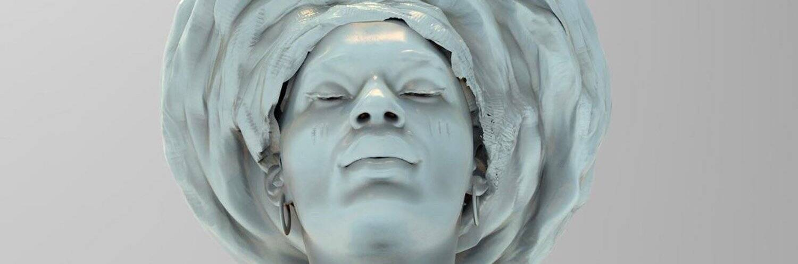

# Madame...

我一直对肖像画很感兴趣。画一个人并及时捕捉瞬间的能力。在这一刻，一切皆有可能，一切都是真实的，一切都是现在。这是夫人，我朋友的一幅画，多年前他的脸吸引了我的眼球，我很幸运现在能画出来。每个月，我都会为这幅画添加一个新的细节，这是我自己的智能合约上的第一个细节。

▶ 什么是夫人……？
Madame... 是一个 NFT（不可替代代币）集合。存储在区块链上的数字艺术品集合。
▶ 有多少夫人...代币存在？
总共有 50 个 Madame... NFT。目前 5 位所有者的钱包中至少有一位女士... NTF。
▶ 最近卖了多少夫人……？
过去 30 天内售出了 0 个 Madame... NFT。

