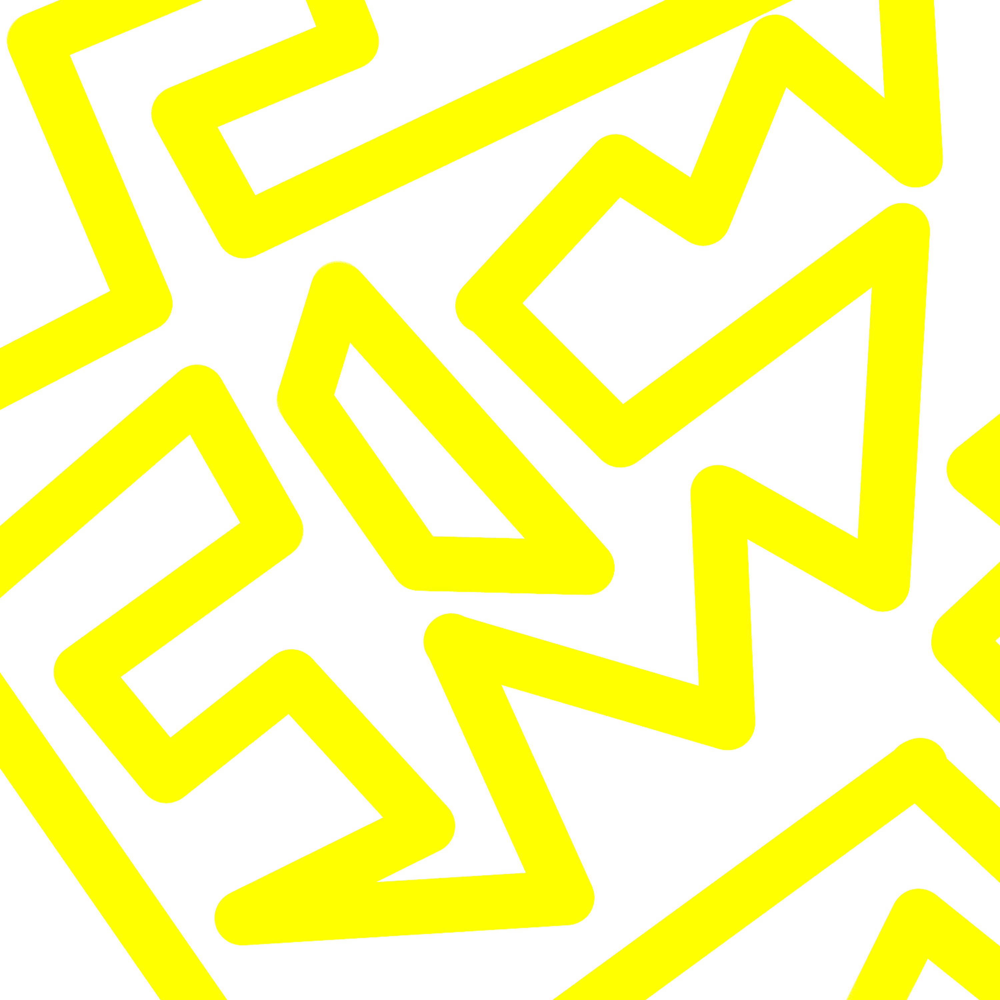

# Mad Brain

Mad Brain 是 100 件手绘 1/1 艺术品的集合 大部分 ETH 来自 Mad Brain 系列的销售，我将寻找 NFT 艺术家并为他们购买一件独家作品。这些作品将在 Mad Brain Artists 收藏中铸造，每件有 20 份。

这 20 份副本将免费提供给疯狂大脑收藏的持有者（仅汽油费）。

该系列专为实用而设计。艺术是我自己的，因为我想在项目上留下我的签名。然而，这个系列的主要目标是帮助 NFT 领域的新艺术家。在我的旅程中，我遇到了许多非常有才华的艺术家，他们无法出售 NFT，或者遇到很多困难。由于大部分 ETH 来自 Mad Brain 系列的销售，我将寻找 NFT 艺术家并为他们购买独家作品。这些作品将在 Mad Brain Artists 收藏中铸造，每件有 20 份。

