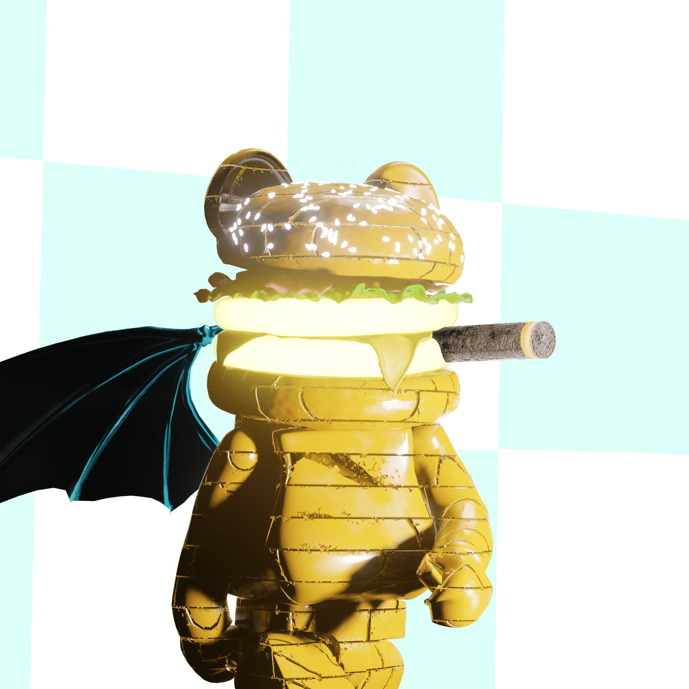

# MADMAN STUDIO NFT OFFICIAL COLLECTION

Burgerman 是madman studio 创作的，旨在反映资源分配不均，包括食物短缺导致一些人营养不足。我们只需要食物和水来建立身体，没有什么复杂的。汉堡包已经含有足够的营养：（碳水化合物、脂肪、蛋白质、矿物质、维生素）为人体提供能量。但汉堡包通常被贴上不健康的快餐标签。

**▶ 什么是 MADMAN STUDIO NFT 官方合集？**
MADMAN STUDIO NFT OFFICIAL COLLECTION 是一个 NFT（Non-fungible token）集合。存储在区块链上的数字艺术品集合。

**▶ 存在多少 MADMAN STUDIO NFT OFFICIAL COLLECTION 代币？**
总共有 366 个 MADMAN STUDIO NFT 官方收藏 NFT。目前，227 位所有者的钱包中至少有一个 MADMAN STUDIO NFT OFFICIAL COLLECTION NTF。

