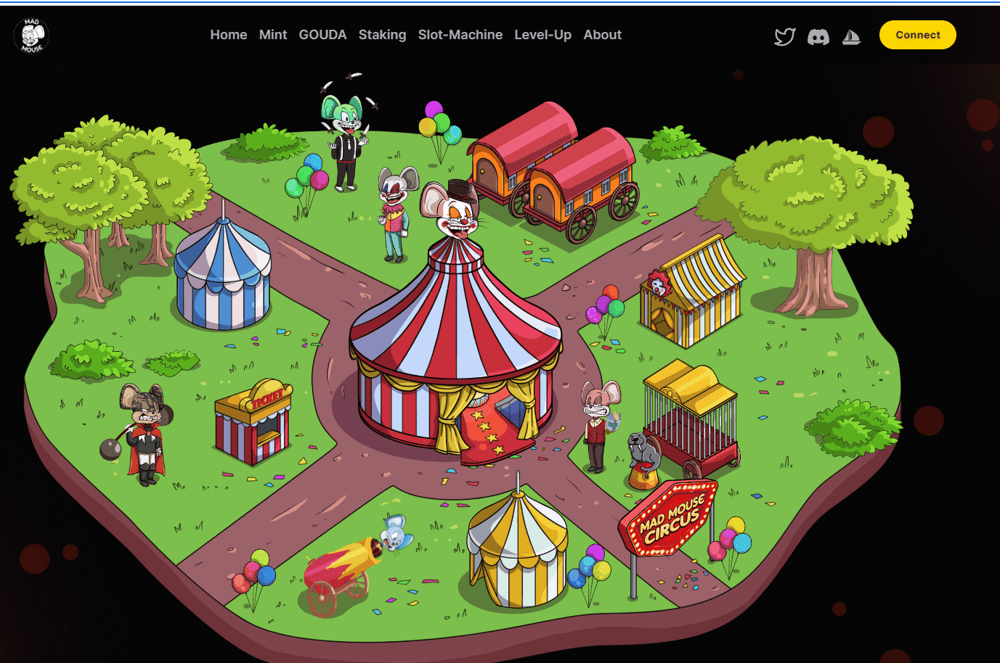

# Mad Mouse Circus Troupe

5000 个疯老鼠马戏团 NFT 原生于以太坊区块链。每个新创建的 NFT 从级别 1 开始，并被分配以下角色之一：小丑、杂耍者、魔术师、训练师或表演者。Mad Mouse Circus Troupe NFT 持有者将能够参与升级系统，将他们的 NFT 从 1 级进化到 3 级。

通过质押 Mad Mouse Circus NFT，持有者将能够获得 GOUDA 代币。GOUDA 用于机制，例如升级系统，并用于喂 GOUDA 老虎机（使用 GOUDA 进行各种 NFT 收藏的拍卖和抽奖）。

