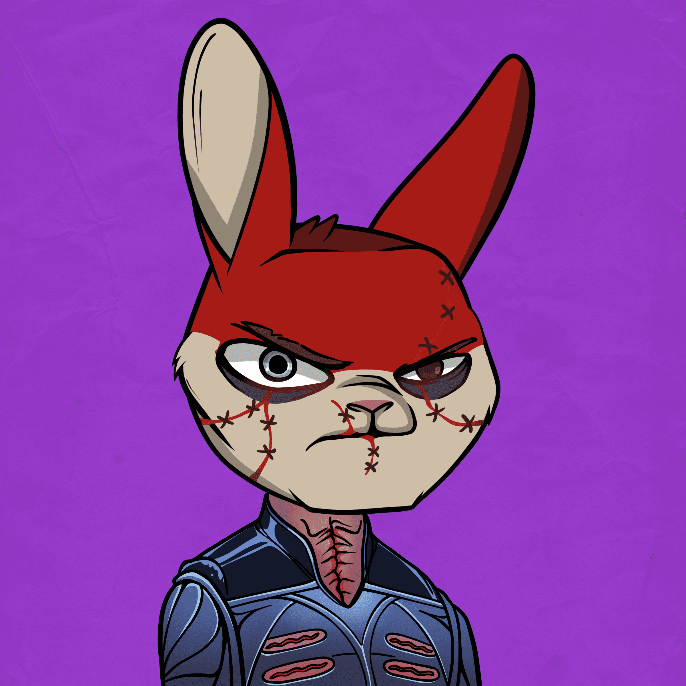

# Mad Rabbits Horror Show

黑暗在疯狂兔子防暴俱乐部宇宙中展开。有人说死者会复活，恶人会横行。紧紧抓住你所爱的人，压下舱口，做好准备。疯狂兔子恐怖秀即将开始。

在以太坊的早期，疯兔在区块链上自由漫游，寻找奖励。随着数量的增加，块变得丰富，神圣的领土......直到大叉子。 Mad Rabbit被散列成支离破碎的群体，由历史上的标志性帮派描绘，每个人都拼命争取新街区的所有权 - 无论成本如何。然而，并非所有人都这么幸运。一些倒霉的兔子进了监狱，永远地散列到了区块链中。

Mad Rabbits Riot Club是一个令人痛心但有益的（字面意思），冒险进入一个喧闹的 ETH 抢劫、地盘争夺战、秘密集会……以及偶尔入狱的世界。仅存在 7,500 只程序生成的兔子，每个 NFT 的持有者都将能够参与独特的活动，这些活动可能会随着时间的推移不断增加他们疯狂兔子的稀有性。

这不是另一个个人资料图片项目。这是面向未来的、社区驱动的生态系统的开始。我们才刚刚开始。

