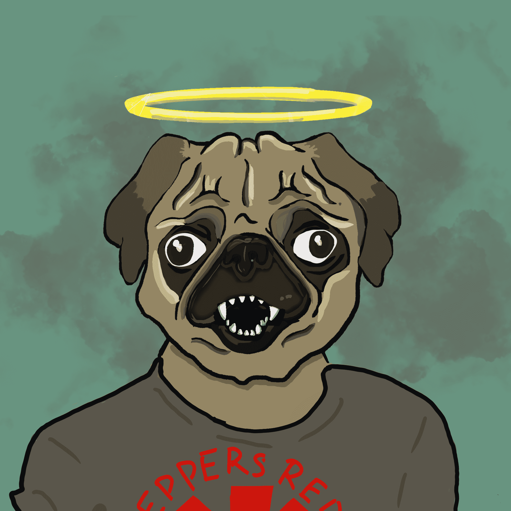

# MaestroPups

MaestroPups 是一个 NFT 项目，拥有 3000 个独特的数字收藏品 - 每个收藏品都作为 ERC721 令牌驻留在以太坊区块链上。所有图像均由一位艺术家的手绘属性以编程方式生成。一次最多购买 10 个收藏品！

事实是，最大的效用是您以高价获得甜美的艺术品。仅 3000 枚以 0.02 的价格通过 INSTANT 显示 - 但我们希望长期建造，因此计划如下：
10% SOLD PUPPY RAID：10 个随机铸币者将被空投随机分布的 Maestro Pups

25% 已售出我们将打印二十 (20) 张 Maestro Pups 的实体帆布版画并将其运送给幼犬持有人。这些仅适用于在前 25% 中铸造的人，并且每个钱包仅限一 (1) 个。

50% 已售出1ETH 捐赠将捐赠给美国的无杀戮庇护所，我们将空投 0.25ETH 给四 (4) 个小狗铸币厂。奖品将仅限于每个钱包一个奖品。

75% 已售出独家 Maestro Pups 商品系列将下降。这些将是帽子、T 恤和贴纸。

90% 已售出1ETH 将捐赠给无杀戮庇护所。我们还将向四 (4) 个随机钱包空投 .25ETH

100% 售出所有 Maestro Pup 铸币者都将获得我们开创性的 Maestro Banner NFT 的免费铸币。这些横幅将是独一无二的，是同类中第一个生成 NFT 横幅，可让您自定义横幅后铸币，以有机地包含 3-5 个您自己的 NFT。这些横幅将在初始下降几周后提供。请参阅 #📣-announcements 中的示例横幅

