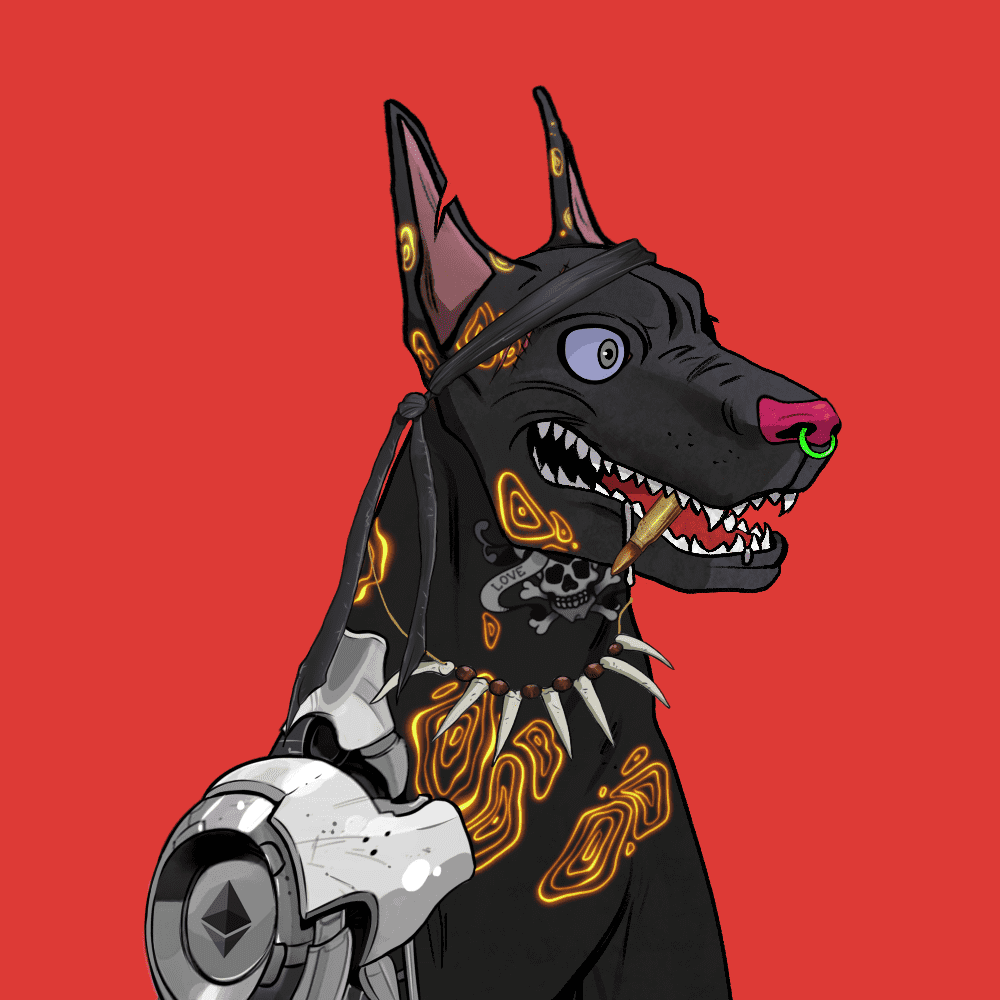

# MafiaReservoirDogs

集合是在原样的基础上开发的。没有承诺，只有艺术。买了 NFT - 得到了 NFT。迪尔。合同创建者不对任何地方或任何人在 Open Sea 上的此页面以外的任何地方作出的任何承诺负责。任何人或任何地方都可以将 Arts 用于商业、修改、分发等。

▶ 什么是黑手党水库？
MafiaReservoir 是一个 NFT（非同质代币）集合。存储在区块链上的数字艺术品集合。
▶ 有多少 MafiaReservoir 代币？
总共有 9,017 个 MafiaReservoir NFT。目前，2,024 位所有者的钱包中至少有一个 MafiaReservoir NTF。
▶ MafiaReservoir 最昂贵的交易是什么？
售出的最昂贵的 MafiaReservoir NFT 是 Mafia Gang Game #5322。它于 2022-06-10（3 个月前）以 4.1 美元的价格售出。
▶ 最近卖出了多少 MafiaReservoir？
过去 30 天内售出了 14 个 MafiaReservoir NFT。
▶ MafiaReservoir 的成本是多少？
在过去 30 天里，最便宜的 MafiaReservoir NFT 销售额低于 2 美元，最高销售额超过 4 美元。在过去 30 天内，MafiaReservoir NFT 的中位价格为 3 美元。

